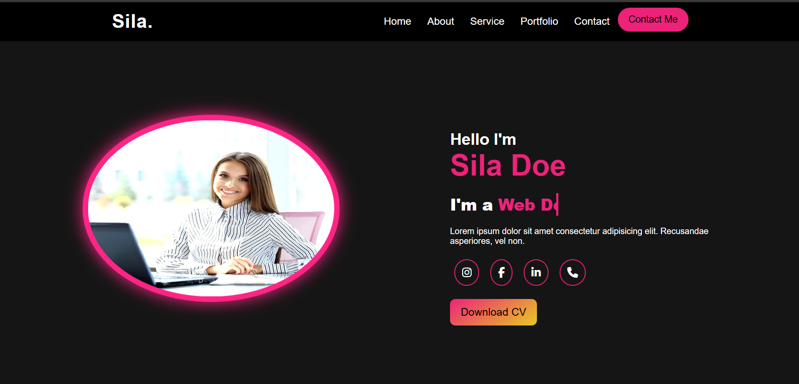

# Sila’s Personal Portfolio

A personal website showcasing Sila Doe’s bio, services and work in a responsive layout.

## Features
- Responsive design for all devices  
- Sections: Home · About · Services · Portfolio · Contact  
- Simple contact form  

## How to Run
1. Clone or download the project  
2. Open `index.html` in a modern browser  

## Tech Stack
- HTML5  
- CSS3  
- Font Awesome  

## Project Structure
index.html
style.css
img/ ← project images
assets/ ← screenshot.png

## Screenshot

